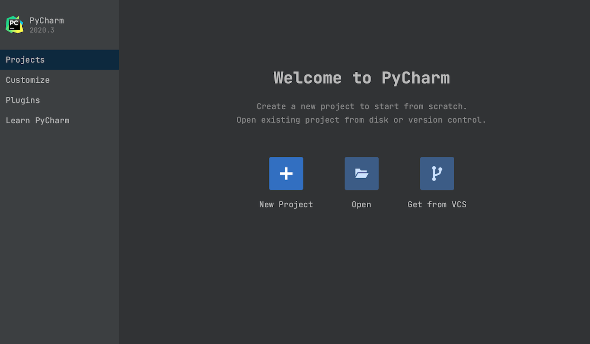
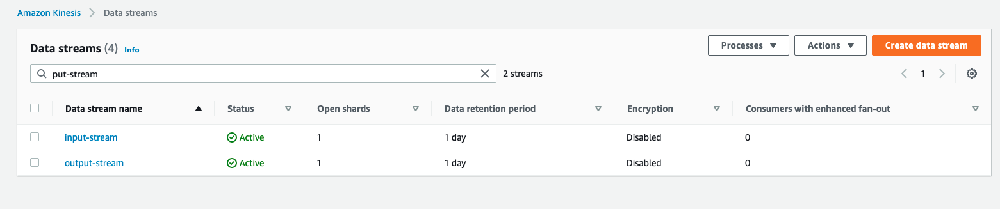
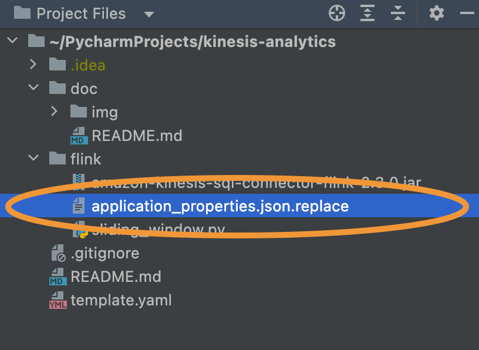
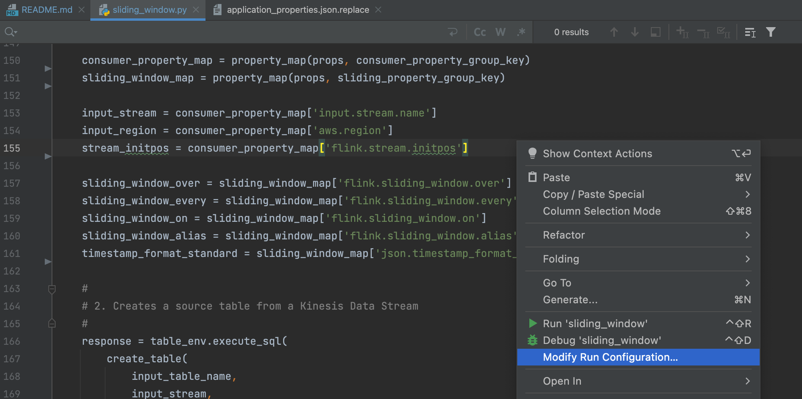
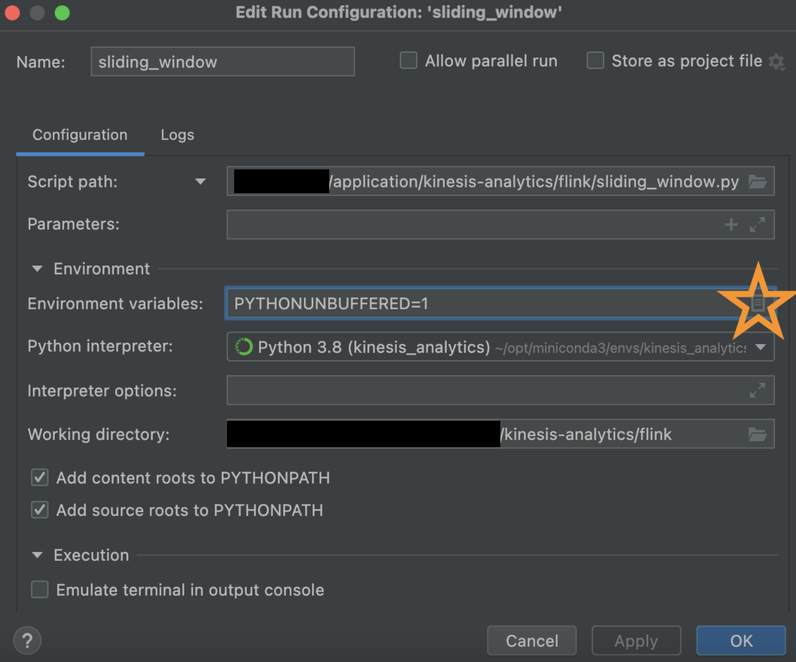
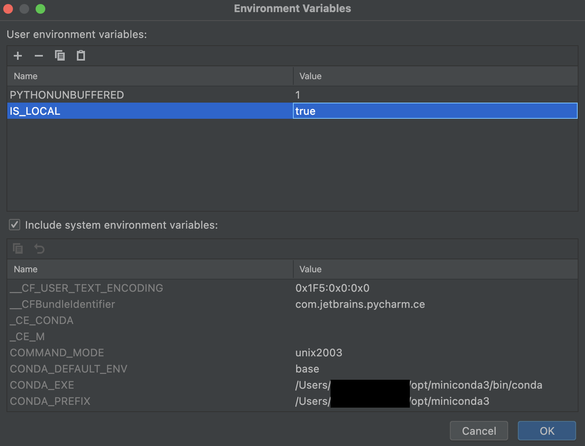
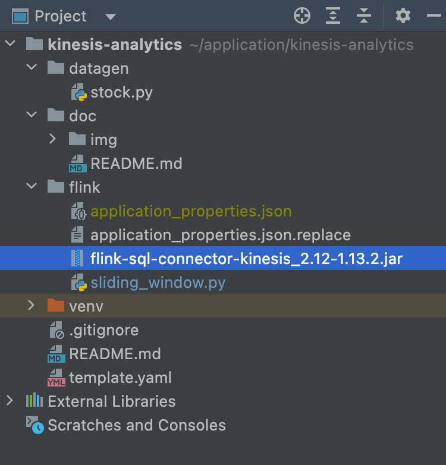
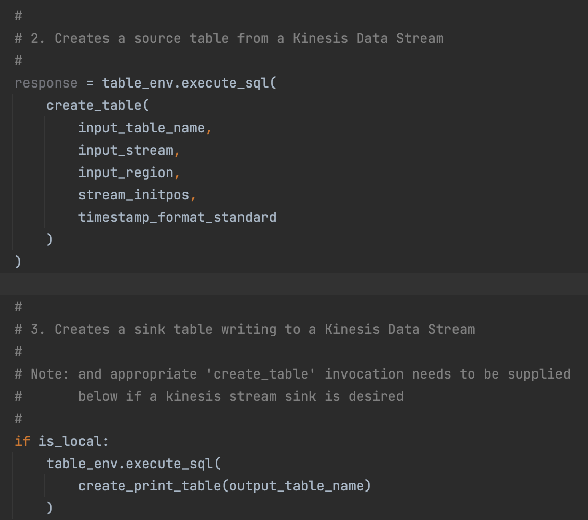
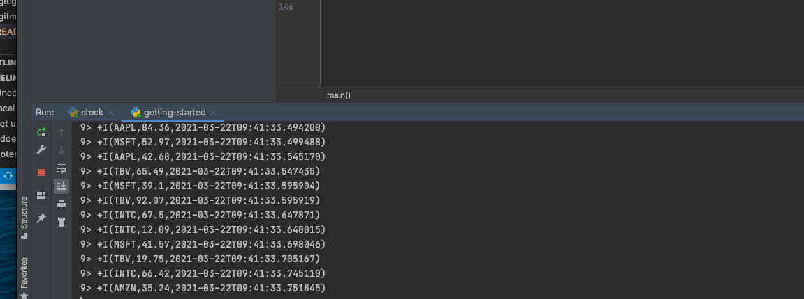

# Getting Started

1. Install PyCharm
   1. First, [install miniconda](https://docs.conda.io/en/latest/miniconda.html) for Python 3.8
   2. Then, create and activate a `kinesis_analytics` environment:

      ```bash
      conda create --name kinesis_analytics
      conda init
      conda activate kinesis_analytics
      ```
   3. Go to the [Jetbrains Website to download](https://www.jetbrains.com/pycharm/download/)--use the Community edition because it's free!
   4. Select your operating system and download it, then run the executable to install.
   5. Open Pycharm

2. Set up Pycharm with Conda
   1. Clone this GitHub repository locally
   2. When you first open up the IDE, select `New Project`, then set the `Location` to the local path of the git repository

   

3. Set up AWS Resources for local development
   1. Go into your AWS account and create an input Kinesis Data Stream and an Output Kineisis Data Stream--they can be one shard each, this is fine!

   

   2. Ensure you have the proper permissions to read / write to these streams through your IAM user locally. If not, you can use a local Kinesis engine like [Kinesalite](https://github.com/mhart/kinesalite) to simulate this.

4. Run the Getting Started example.

    

   1. Copy [`flink/application_properties.json.replace`](https://github.com/jeff1evesque/kinesis-analytics/blob/master/flink/application_properties.json.replace) as `flink/application_properties.json`, change the `input.stream.name` to be the input kinesis stream name, and optionally remove the producer configuration in the same file, then Hit save.

   2. Next, click [`flink/sliding_window.py`](https://github.com/jeff1evesque/kinesis-analytics/blob/master/flink/sliding_window.py), then right click within the code and click `Modify Run Configuration`.

      

      This will open a dialog box where we can define our `IS_LOCAL` environment variable. We need this because I've written the script to use a local `application_properties.json` file if this switch is enabled! Without this, application will be looking in `/etc/flink/application_properties.json` which is where KDA places it.

      

      Click on the icon next to Environment Variables which will open up another dialog box. In this one, on the bottom right you will see a `+` sign. Use this to add `IS_LOCAL` environment variables.

      

      Hit `OK`, then `Apply` and `OK`.

   3. Ensure that java is installed locally:

      ```bash
      brew install java11
      sudo ln -sfn /usr/local/opt/openjdk@11/libexec/openjdk.jdk /Library/Java/JavaVirtualMachines/openjdk-11.jdk
      ```

   4. Download and set up your Kinesis Connector.

      Ensure a [flink-sql-connector](https://mvnrepository.com/artifact/org.apache.flink/flink-sql-connector-kinesis_2.12/1.13.2) jar file is placed in the `flink/` directory. It's the Amazon Kinesis SQL Connector for Flink. This will need to be bundled with your application on deploy (already automated within associated CodeBuild), and needs to match the `jarfile` in `application_properties.json`. Lastly, ensure the jar file is in the `.gitignore` because adding jar files to git is not a good practice.

      

   5. Once this is all set up, we're almost ready to run our code! First, if the application is to run locally, ensure the `DeployAdmin` IAM user has the following permission added to `DeployAnalystAdminPolicy`:

   ```json
   {
       "Version": "2012-10-17",
       "Statement": [{
          "Effect": "Allow",
          "Action": [
              "kinesis:DescribeStream",
              "kinesis:PutRecord",
              "kinesis:PutRecords",
              "kinesis:GetShardIterator",
              "kinesis:GetRecords",
              "kinesis:ListShards",
              "kinesis:DescribeStreamSummary",
              "kinesis:RegisterStreamConsumer"
          ],
          "Resource": "*"
       }]
   }
   ```

   **Note:** for best practices, the above permission should not be permanently added.

   6. To implement Kinesis (source) to Kinesis (sink), replace `create_print_table` invocation from the `main` function with `create_table`. For local development, no further changes are required.

   

   7. Now, right click into the code and hit `Run 'sliding_window'` to start the code execution.

   8. But wait! Remember to appropriately send data to the source Kinesis Data Stream. A sample [`datagen/stock.py`](https://github.com/jeff1evesque/kinesis-analytics/blob/master/datagen/stock.py) has been provided in this project, which can facilitate this.  However, the corresponding event source mapping function on the source Kinesis Data Stream must be temporarily disabled during local development/testing.  Otherwise, corresponding records will be written to the datalake.

   After a few seconds of sending data, you should see the print statements come through the console of the IDE in the `sliding_window` tab.

   
